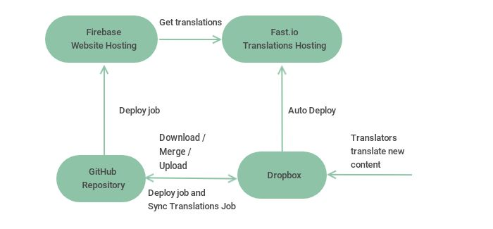

# Frontend Infrastructure

| What | Where | Project Name or Folder | Account | Comments |
|---|---|---|---|---|
| Source code | GitHub | https://github.com/patrikturi/kFrontend | patrik.turi.0xff@gmail.com | Can invite other users or fork the repo |
| Build Pipelines | Azure | https://dev.azure.com/patrikturi/kFrontend | patrik.turi.0xff@gmail.com | Can invite other users |
| Website (staging) | Google Firebase | `kfrontend-staging` | patrik.turi.0xff@gmail.com | Can invite other users or tranfer project if needed |
| Translations source | Dropbox | `/locales` | ksoccer-dev@outlook.com | Shared account for translators |
| Translations hosting | Fast.io | https://ksoccer-translations.imfast.io/ | ksoccer-dev@outlook.com | - |
|  |  |  |  |  |

